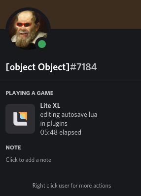

# discord rich presence for [lite-xl](https://github.com/franko/lite-xl)
Inspired by [vscode rich presence](https://github.com/iCrawl/discord-vscode)

# Installation
## prerequisites:
  `python3`, `pickle`, `argparse`, and `pypresence`

  only tested on Linux but should theoretically work on any os that works with lite and has these packages installed
## actual installation
a) clone this repo in your lite-xl plugins folder

b) clone this repo and manually copy the files into your lite-xl plugins folder

note: Regardless of which option you choose, the files must be in `plugins/lite-xl-discord/...` If the folder they're in is named anything other than `lite-xl-discord`, the plugin **WILL NOT WORK**

# Future goals:
  - better IPC (current system is very jank)
  - language status like the vsocde plugin
  - use only lua, rather than rely on python
  
# Contributing
  - Fork this repo
  - Mess with the code
  - Make a PR
  - or add issues, those are helpful too.
